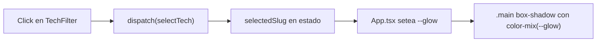

# StackQuiz: rebrand, timer, colores por tecnología y glow dinámico

## 1. Timer como el mockup

El mockup muestra el timer como una pill con icono de reloj, texto y borde cian, fondo oscuro/transparente.

- En [src/components/Timer.tsx](src/components/Timer.tsx): agregar un `<svg>` de reloj (inline) antes del tiempo, dentro del `.timer`.
- En [src/index.css](src/index.css), ajustar `.timer`: `color: var(--primary)`, `border-color: rgba(24,197,216,0.5)`, fondo `transparent` (o `--surface` translúcido), `display: inline-flex; align-items: center; gap`, y tamaño del `svg`.

## 2. Rebrand a "StackQuiz"

Reemplazar todas las referencias a "React Quiz" / "The React Quiz":

- [src/components/Header.tsx](src/components/Header.tsx): `<h1>StackQuiz</h1>` y `alt` del logo.
- [index.html](index.html): `<title>StackQuiz</title>`.
- [src/components/StartScreen.tsx](src/components/StartScreen.tsx): `<h2>Bienvenidxs a StackQuiz!</h2>`.
- [package.json](package.json): `"name": "stackquiz"`.
- [README.md](README.md): título y alt de la imagen.

Nota importante: NO renombres la carpeta del proyecto ni el repo `react-quiz` (operación destructiva fuera de alcance). 

## 3. Color por tecnología (en la base de datos)

Nueva migración [supabase/migrations/0003_add_tech_colors.sql](supabase/migrations/0003_add_tech_colors.sql):

- `alter table public.technologies add column if not exists color text not null default '#18c5d8';`
- Backfill: `react` -> `#61dafb`, `typescript` -> `#3178c6`.

Frontend en [src/context/QuizContext.tsx](src/context/QuizContext.tsx):

- Agregar `color: string` al type `Technology`.
- Incluir `color` en el `select(...)` de Supabase.

En [src/components/TechFilter.tsx](src/components/TechFilter.tsx) + [src/index.css](src/index.css):

- Pasar el color como CSS var inline: `style={{ "--tech-color": tech.color }}`.
- `.btn-tech::before` (el punto) y el estado `.active` usan `var(--tech-color)` para el dot/borde.

## 4. Glow/shadow de la UI según la tecnología seleccionada

Estado: ya existe `selectedSlug`. En [src/App.tsx](src/App.tsx) calcular el color de la tech seleccionada y exponerlo como CSS var en el contenedor `.app`:

```tsx
const { status, selectedSlug, technologies } = useQuiz();
const glow = technologies.find((t) => t.slug === selectedSlug)?.color;
return (
  <div className="app" style={glow ? { ["--glow" as string]: glow } : undefined}>
```

En [src/index.css](src/index.css):

- Definir `--glow` por defecto (cian) en `:root`.
- En `.main` agregar al `box-shadow` un halo de color usando `color-mix`, p. ej.:
`box-shadow: 0 24px 60px -28px rgba(0,0,0,.7), 0 0 90px -25px color-mix(in srgb, var(--glow) 55%, transparent);`
- Transición suave del box-shadow al cambiar de tecnología.

### Flujo del glow




## Verificación

- Ejecutar `pnpm build` al finalizar (regla del proyecto).
- Revisar visualmente: timer con icono, nombre StackQuiz, dots de colores en el filtro y cambio de glow al seleccionar.

