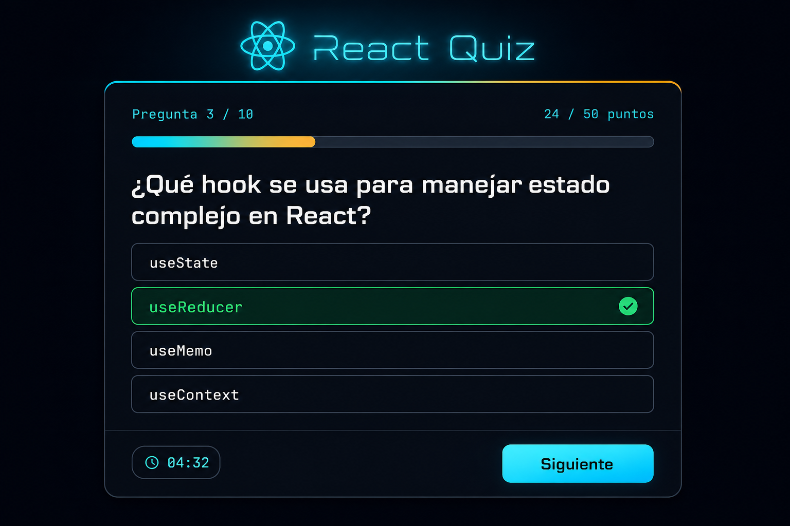

# StackQuiz

App interactiva para practicar preguntas técnicas (React, TypeScript, y más). Eliges una tecnología, respondes su quiz contra reloj y obtienes tu puntaje final con highscore.

Construida con **React 19 + TypeScript + Vite**, usando **Supabase (Postgres)** como backend de preguntas.



> 💡 La imagen de arriba es un mockup de referencia. Si querés, reemplazá `docs/preview.png` por una captura o GIF real de tu app.

## ✨ Qué hace

- Elegir una tecnología desde un filtro y jugar su quiz.
- Responder preguntas y ver el resultado al instante (correcta/incorrecta).
- Seguir el avance con barra de progreso y puntaje acumulado.
- Temporizador global por partida (30s por pregunta).
- Finalizar, reiniciar la partida y conservar el mejor puntaje (highscore).

## 🏗️ Decisiones de arquitectura

El proyecto está pensado como ejemplo de manejo de estado en React sin librerías externas de estado.

### Estado con `useReducer`

Todo el flujo del quiz vive en un único `reducer` con un estado tipado. El estado se modela como una máquina de estados a través del campo `status`:

```
loading → ready → active → finished
              ↘ error
```

Cada interacción se expresa como una acción explícita (`selectTech`, `start`, `newAnswer`, `nextQuestion`, `tick`, `finish`, `restart`...), lo que mantiene la lógica centralizada, predecible y fácil de testear. Se eligió `useReducer` sobre `useState` por la cantidad de transiciones interdependientes (puntaje, índice, respuesta, tiempo).

### Estado global con Context API

`QuizProvider` (`src/context/QuizContext.tsx`) envuelve la app y expone el estado + `dispatch` mediante el hook `useQuiz()`. Así cualquier componente accede al estado sin _prop drilling_. Se usó Context (no Redux/Zustand) porque el alcance es acotado y no justifica una dependencia extra.

### Datos con Supabase (Postgres)

Las preguntas no están hardcodeadas: viven en Supabase y se cargan al montar el provider (`useEffect`) con `@supabase/supabase-js`. El esquema separa `technologies` y `questions` (relación 1‑N por `slug`), con **Row Level Security** y lectura pública. El cliente solo usa la _publishable key_, segura para el frontend.

## 🧰 Stack

| Capa | Tecnología |
|------|-----------|
| UI | React 19 |
| Lenguaje | TypeScript |
| Build/Dev | Vite |
| Estado | `useReducer` + Context API |
| Backend/Datos | Supabase (Postgres) |
| Calidad | ESLint |

## 🚀 Cómo levantarlo en local

### 1. Requisitos

- Node.js 18+
- pnpm
- Una cuenta en [supabase.com](https://supabase.com)

### 2. Instalar dependencias

```bash
pnpm install
```

### 3. Configurar Supabase

1. Crea un proyecto en Supabase.
2. En **SQL Editor**, ejecuta las migraciones de `supabase/migrations/` en orden (`0001_init_quiz.sql`, `0002_add_typescript.sql`, ...). Crean las tablas, las policies de RLS y cargan las preguntas de ejemplo.
3. Copia el archivo de entorno y completa tus credenciales (Project URL y publishable key):

```bash
cp .env.example .env
```

```env
VITE_SUPABASE_URL=https://tu-proyecto.supabase.co
VITE_SUPABASE_KEY=tu-publishable-key
```

> ⚠️ Usa siempre la _publishable key_. Nunca expongas la `service_role`/secret key en el frontend.

### 4. Arrancar la app

```bash
pnpm dev
```

Abre `http://localhost:5173`.

### Scripts disponibles

| Comando | Descripción |
|---------|-------------|
| `pnpm dev` | Servidor de desarrollo |
| `pnpm build` | Build de producción (`tsc` + `vite build`) |
| `pnpm preview` | Sirve el build de producción |
| `pnpm lint` | Linter (ESLint) |

## 📁 Estructura

```
src/
  App.tsx                 # Renderiza la UI según el status del quiz
  main.tsx                # Entry point, envuelve la app con QuizProvider
  context/QuizContext.tsx # Estado global: reducer, context y fetch a Supabase
  components/             # UI del juego (Question, Options, Progress, Timer, ...)
  lib/supabase.ts         # Cliente de Supabase
supabase/migrations/      # Esquema SQL + seed de preguntas
```
